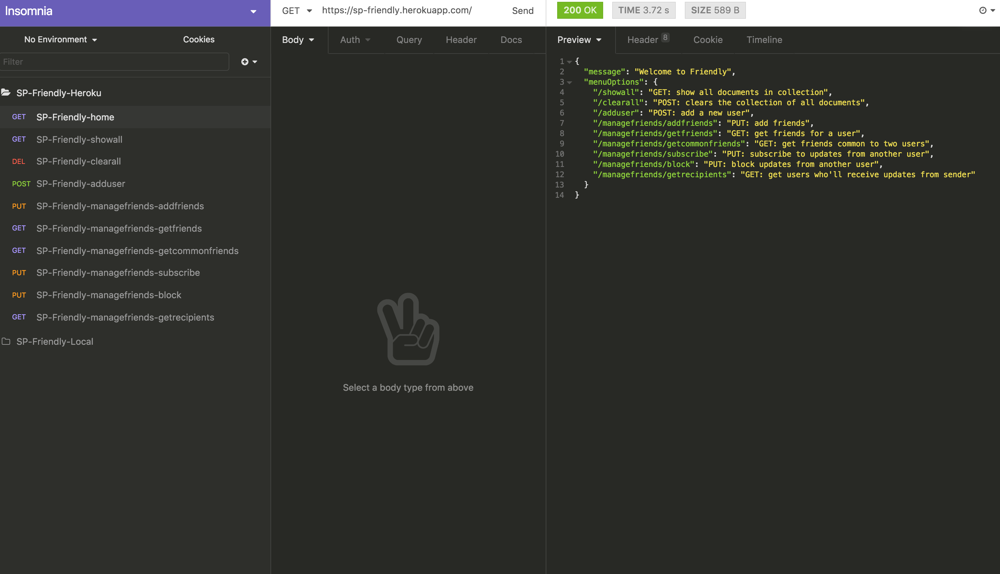
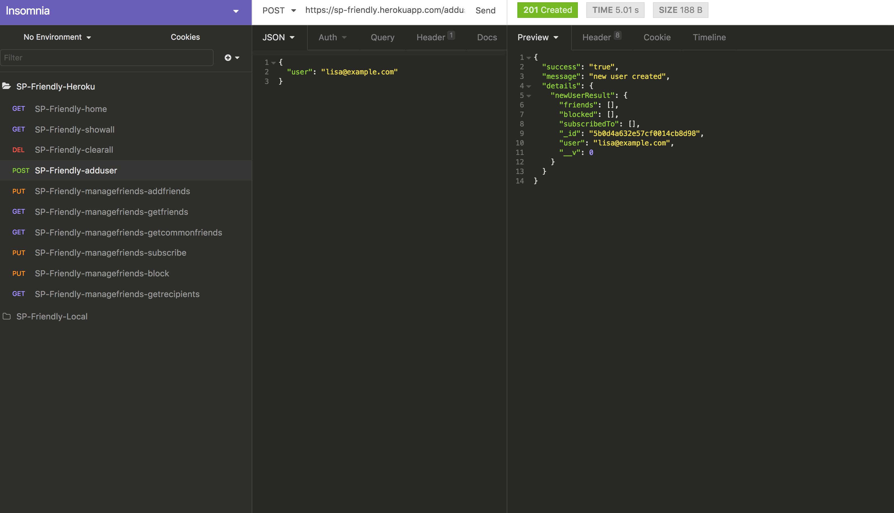
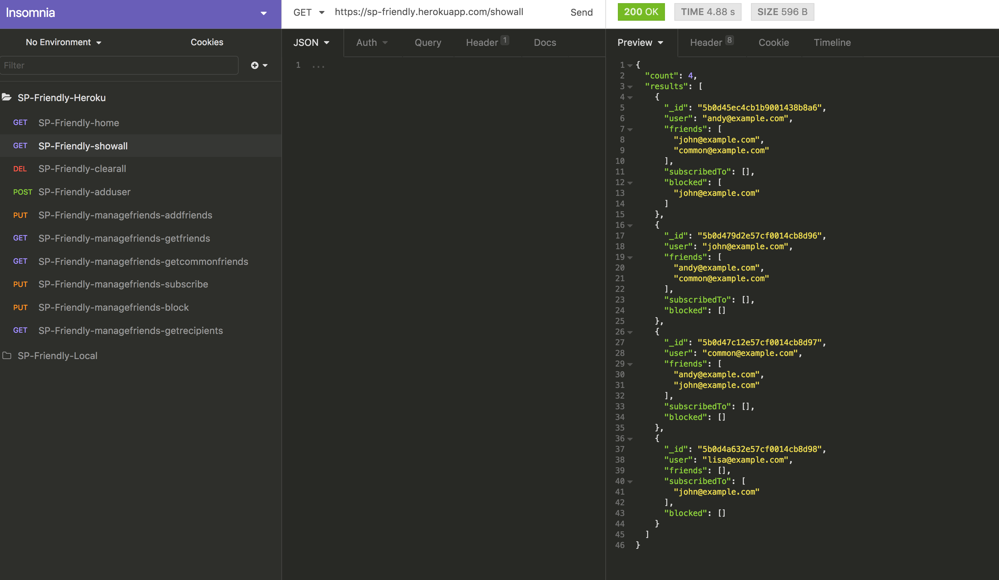

# SP-FRIENDLY

## Getting Started

Deployed on Heroku at: https://sp-friendly.herokuapp.com/
To view the app, please head over to the above-mentioned URL via Insomnia or Postman. You will see a welcome JSON with available endpoint options.

_NOTE: Heroku can be a bit slow. Please wait around 5 seconds for some responses._

The following endpoints have been covered:

* /showall: GET method: show all documents in collection
* /clearall: POST method: clears the collection of all documents
* /adduser: POST method: add a new user
* /managefriends/addfriends: PUT method: add friends if they already exist in collection
* /managefriends/getfriends: GET method: get friends for a user
* /managefriends/getcommonfriends: "GET method: get friends common to two users",
* /managefriends/subscribe: "PUT method: subscribe to updates from another user",
* /managefriends/block: "PUT method: block updates from another user",
* /managefriends/getrecipients: "GET method: get users who'll receive updates from sender"

Note:

* The backend comes populated with all the scenarios covered in the requirements.
* To add further users, please add the following JSON body as shown:
  

_showall_ and _clearall_ require no JSON body. All other endpoints require JSON body as specified in the requirements.
Here is a screenshot of _showall_ with current users in the collection.

## Dependencies

* Express
* NodeJS
* Mongoose
* MongoDB
* Body-parser
* Morgan
